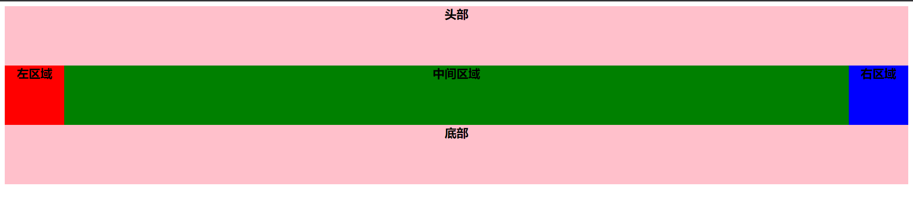
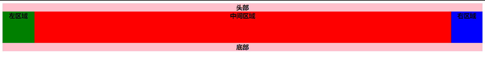

# 圣杯布局和双飞翼布局
## 作用
::: tip 
圣杯布局和双飞翼布局解决的问题是相同的，就是两边顶宽，中间自适应的三栏布局，中间栏要在放在文档流前面以优先渲染。
:::
## 区别
::: tip 
圣杯布局：为了让中间div内容不被遮挡，将中间div设置了左右padding-left和padding-right后，将左右两个div用相对布局position: relative并分别配合right和left属性，以便左右两栏div移动后不遮挡中间div。
:::
::: tip
双飞翼布局：为了让中间div内容不被遮挡，直接在中间div内部创建子div用于放置内容，在该div里用margin-left和margin-right为左右两栏div留出位置。
:::
## 圣杯布局
::: tip
优点：不需要添加dom节点
:::

::: tip
缺点：圣杯布局的缺点：正常情况下是没有问题的，但是特殊情况下就会暴露此方案的弊端，如果将浏览器无线放大时，「圣杯」将会「破碎」掉。如图：当middle部分的宽小于left部分时就会发生布局混乱。（middle<left即会变形）
:::
效果

html代码

``` html
<body>
  <header class="bold">头部</header>
  <div class="clear">
    <div class="center bold green">中间区域</div>
    <div class="left bold red">左区域</div>
    <div class="right bold blue">右区域</div>
  </div>
  <footer class="bold">底部</footer>
</body>
```

css代码

``` css
.bold {
  font-size: 20px;
  font-weight: bold;
  text-align: center;
}
header, footer {
  height: 100px;
  background-color: pink;
}
.clear{
  padding: 0 100px;
}
.clear::after {
  content: '';
  display: block;
  clear: both;
}
.center, .right, .left {
  float: left;
  height: 100px;
}
.center{
  width: 100%;
}
.right, .left{
  width: 100px;
}
.left{
  position: relative;
  margin-left: -100%;
  left: -100px;
}
.right{
  position: relative;
  margin-left: -100px;
  right: -100px;
}
.red {
  background-color: red;
}
.green {
  background-color: green;
}
.blue {
  background-color: blue;
}
```
## 双飞翼布局
::: tip
优点：不会像圣杯布局那样变形
:::

::: tip
缺点是：多加了一层dom节点
:::
效果

html代码
``` html
<body>
  <header class="bold">头部</header>
  <div class="clear">
    <div class="center bold red">中间区域</div>
  </div>
  <div class="left bold green">左区域</div>
  <div class="right bold blue">右区域</div>
  <footer class="bold">底部</footer>
</body>
```

css代码

``` css
.bold {
  font-size: 20px;
  font-weight: bold;
  text-align: center;
}
header, footer {
  background-color: pink;
}
.red {
  background-color: red;
}
.green {
  background-color: green;
}
.blue {
  background-color: blue;
}
.left,.right{
  float: left;
}
footer{
  clear: both;
}
.left,.right{
  width: 100px;
  height: 100px;
}
.left{
  margin-left: -100%;
}
.right{
  margin-left: -100px;
}
.clear {
  width: 100%;
  float: left;
}
.center{
  height: 100px;
  margin: 0 100px;
}
```